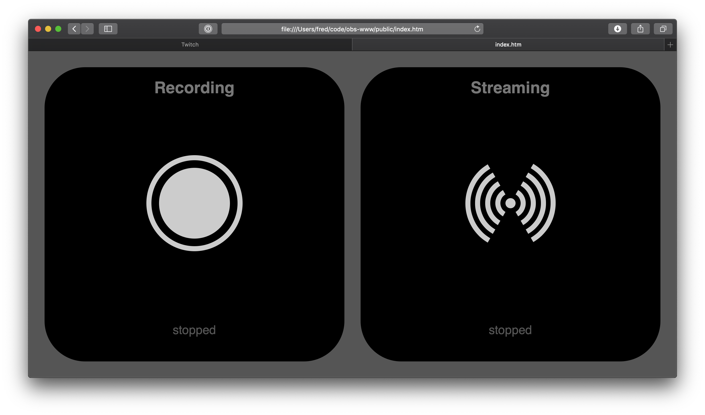
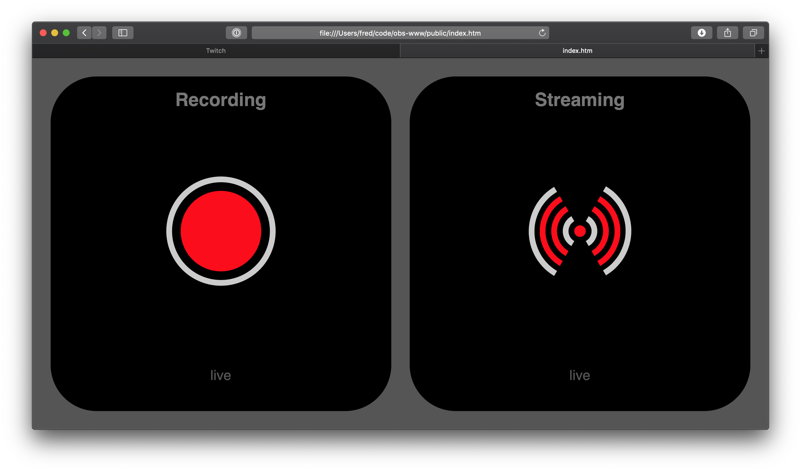
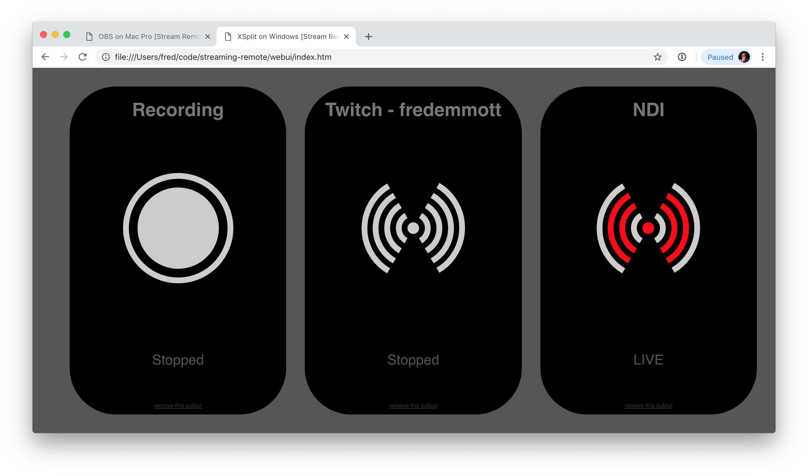

# Streaming Remote

Streaming Remote provides secure remote control of
[OBS Studio](https://obsproject.com) or [XSplit](https://www.xsplit.com) via TCP
sockets, WebSockets, local unix sockets (MacOS and Linux) or named pipes
(Windows).

A basic Web UI is also provided.

## Web UI

The web UI is tested on Chrome and Safari; it is known not to work on Edge.

If local storage is available, the web UI will save connection settings; local
storage is not available when opening the index.html file directly in Safari,
but it works in Chrome.

The WebUI can also be accessed [online](https://streaming-remote.fredemmott.com) - all data transfer and storage is local to your browser.

### Connection Screen


### OBS




### XSplit



## Capabilities

- retrieve a list of outputs and states
- start an output (stream or recording)
- stop an output
- push notifications for output state changes
- software-agnostic: there are no protocol or client differences when using
  OBS vs XSplit
- modern security (authentication and encryption) via
  [libsodium](https://libsodium.org)

We expect to expand the capabilities in the future.

## Requirements

- [CMake](https://cmake.org)
- [libsodium](https://libsodium.org)
- [Qt5](https://www.qt.io)
- [yarn](https://yarnpkg.com/en/) or [npm](https://www.npmjs.com) if building
  the web UI or the XSplit plugin
- [OBS Studio](https://obsproject.com) if building the OBS plugin

If you are on MacOS, we recommend building OBS from source, and installing
the other dependencies via [Homebrew](https://brew.sh).

## Building The Plugins

```
streaming-remote$ mkdir build
streaming-remote$ cd build
build$ cmake ../plugins \
  -DWITH_XSPLIT_PLUGIN=ON \
  -DWITH_OBS_PLUGIN=ON \
  -DOBS_SOURCE_DIR=/path/to/obs-source
build$ make
```

The XSplit plugin can be built on all platforms, even though XSplit itself
is only available on Windows. This is useful when working on changes that
affect the `StreamingSoftware` class on a non-Windows machine.

### Qt Paths

You may need to add paths to `CMAKE_PREFIX_PATHS` for CMake to find Qt.

On MacOS with Homebrew, this is likely
`-DCMAKE_PREFIX_PATHS=/usr/local/opt/qt/lib/cmake`.

On Windows, this is likely `-DCMAKE_PREFIX_PATH=C:/Qt/lib/cmake`.

### OBS paths

If you did not build OBS Studio from source, you may need to specify several
variables instead of `OBS_SOURCE_DIR`:
- `LIBOBS_INCLUDE_DIR`: the directory containing `obs-module.h`
- `LIBOBS_LIB`: the path to `libobs.so`, `libobs.dll`, `libobs.dylib`, or the
   equivalent for your platform.
- `OBS_FRONTEND_API_INCLUDE_DIR`: the directory containing `obs-frontend-api.h`
- `OBS_FRONTEND_API_LIB`: the path to `libobs-frontend-api.so`, or the
  equivalent for your platform.


## Installing the OBS Plugin

Copy `obs-streaming-remote.so` to your OBS plugins directory.

## Installing the XSplit Plugin

### Native Component

1. Copy the DLLs for QtCore, QtNetwork, QtWebsockets, and sodium into the
   root directory of your XSplit installation - likely
   `C:\Program Files (x86)\StreamLabs\XSplit\x64\`
1. Inside the root directory, there is a `ScriptDlls` directory. Create a
   `Local` directory inside that path.
1.  Copy `xsplit-streaming-remote.dll` to the new `Local` directory
1.  You will need to enable developer mode in XSplit to run self-built DLLs

### JavaScript component

1. in the `plugins/xsplit/js` directory, run `yarn install` or `npm install`
1. run `yarn run webpack --mode production` or
   `npm run webpack --mode production`
1. in XSplit, open the 'Extensions' menu, then 'Add Extension'; select the
   `plugins/xsplit/js/index.html` file

## Building the Web UI

1. in the `webui` directory, run `yarn install` or `npm install`
1. run `yarn run webpack --mode production` or
   `npm run webpack --mode production`
1. open the `webui/index.html` file in Chrome or Safari

## Protocol

There are two message-based protocols:
- a binary [handshake protocol](handshake_protocol.md)
- an encrypted JSON-RPC-based [RPC protocol](rpc_protocol.md)

### Message Passing

For WebSockets, the standard binary mesage functions are used.

For TCP sockets, Unix sockets (MacOS, Linux), and named pipes (Windows), an ASCII `Content-Length: ` header is
sent containing the number of bytes, then CRLF CRLF, then the blob. The next Content-Length header
*immediately* follows the blob.


```
"Content-Length: 7\r\n"
"\r\n
"hello, Content-Length: 6\r\n"
"\r\n"
"world."
```

## License

The contents of this repository is [MIT-licensed](LICENSE).

Note that as the OBS plugin includes and links against
libobs and libobs-frontend-api &emdash; which are licensed under the GNU General
Public License version 2, or (at your option) any later version &emdash; the OBS
plugin as a whole (combined work) is under [the same license](LICENSE.OBS_COMBINED_WORK).
